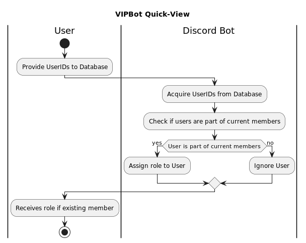

# VIPBot Documentation

## Quick-Overview



This bot manages user IDs in the database, assigning roles automatically upon joining. It also scans the current members to verify if they are in the list. If found, the bot assigns them the role. This bot is especially useful for those intending to move their staff to another server. Simply add their user IDs in the database.

## Table of Contents
- [Creating a Discord Bot Account](#creating-a-discord-bot-account)
- [Inviting the Bot to Your Server](#inviting-the-bot-to-your-server)
- [Hosting the Bot](#hosting-the-bot)
    - [On a Local Device](#hosting-the-bot-on-a-local-device)
    - [On a VPS](#hosting-the-bot-on-a-vps)
- [VPS Choices](#vps-choice)
- [Contact](#contact)

## Creating a Discord Bot Account

1. Ensure you're logged into the Discord website: [Discord](https://discord.com/)
2. Navigate to: [Discord Developers Applications](https://discord.com/developers/applications)
3. Click the "New Application" button on the top right.
4. Name your application and then click "Create".
5. Navigate to the "Bot" tab and click "Add Bot".
6. If you wish your bot to be publicly invited by others, select the "Public Bot" checkbox.
7. Copy the Token using the "Copy" button.
8. Replace `TOKEN` in `config.json` with the bot token you copied.

> ⚠️ **WARNING**: Do not share this Token with anyone. It acts as a password for your bot. Always keep it confidential. If your token is compromised, click "Regenerate" immediately.

## Inviting the Bot to Your Server

1. Click the "OAuth2" tab on the application page.
2. Select the "bot" checkbox under "Scopes".
3. Choose the permissions your bot requires. Necessary permissions can be found in "Needed permissions.txt". Granting "Administrator" permission gives the bot all permissions, use with caution.
4. Use the generated link under "Scopes" to invite your bot to any server where you have the "Manage Server" permission.

## Hosting the Bot

### Hosting the Bot on a Local Device

1. Install the latest version of Python from [Python's Official Site](https://www.python.org/). Ensure Python is added to `$PATH`.
2. Install the required modules. On Windows, navigate to the folder containing this document, press `Shift + Right click` anywhere in the folder, click "Open in PowerShell" and run the command:
    ```bash
    python -m pip install -r requirements.txt
    ```
3. To run the bot, use:
    ```bash
    python main.py
    ```

### Hosting the Bot on a VPS

1. Set up the VPS and establish an SSH connection.
2. Transfer the bot's folder to the VPS using SFTP (e.g., FileZilla).
3. Install necessary programs and libraries on the VPS.
4. Use a supervisor like `supervisord` to manage bot execution.
5. Implement security measures like securing SSH, using keyfiles, etc.
6. Devise a backup strategy to safeguard your data.

> 📌 **Note**: Hosting on a VPS requires in-depth knowledge and research. Always secure your VPS to prevent unauthorized access or data breaches.

## VPS Choice

The `discord.py` community recommends the following VPS providers:

- [Scaleway](https://scaleway.com/) - Affordable VPSes based in Europe.
- [DigitalOcean](https://digitalocean.com/) - Popular US-based VPS provider with global availability.
- [OVH](https://ovh.co.uk/) - Affordable VPSes with France and Canadian locations.
- [Time4VPS](https://time4vps.eu/) - Based in Lithuania.
- [Linode](https://linode.com/) - Another option for affordable VPSes.
- [Vultr](https://vultr.com/) - US-based, similar to DigitalOcean.
- [GalaxyGate](https://galaxygate.net/) - Reliable and affordable, used by popular bots.

Choose a provider based on your bot's needs, like data storage, voice channel activity, and image/video manipulation.

> ⚠️ **Caution**: Avoid free hosting providers like Heroku for Discord bots. They often lead to performance and reliability issues.

## Contact

If you have questions or encounter issues with your bot, please contact me.

- Mikael. 
